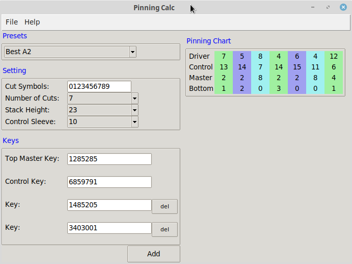
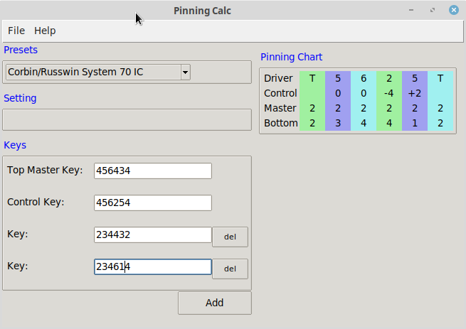

# Pinning Calculator

A simple desktop application written in Python to calculate a pinning chart for the keys provided.

Started in December 2020 by [Tony Cooper](mailto:tony@balsa.co.nz) of [Balsa Limited](https://balsa.co.nz) (New Zealand)

This project is is an MIT-licensed open source project and completely free to use.

- Inline
  - Arrow
  - Corbin/Russwin K Class
  - Corbin/Russwin System 70
  - Kwikset
  - Lockwood Australia
  - Ruko/Assa 600
  - Sargent
  - Schlage 6Pin
- SFIC
  - Best A2
  - Best A3
  - Best A4
- LFIC
  - Corbin/Russwin System 70 IC

